# TP - Superviser son application à l'aide d'une stack de monitoring
## Contexte
Jusque là, vous avez abordé différentes approches pour tester une application web au cours de sa phase de réalisation. Dans un monde idéal, vous auriez éliminé tous les bugs grâce à votre usine de tests, votre application pouvant s'exécuter en production sans jamais rencontrer de problèmes.
Dans la réalité, il est probable que des anomalies soient passées au travers du filet, et se retrouvent dans votre application en production.

Du fait du coût d'un bug en production, il est indispensable de s'outiller pour superviser votre application, et détecter au plus vite un dysfonctionnement.

Ce TP porte sur la visualisation de métriques, un moyen de superviser en temps réel une application. Les métriques permettent de visualiser plusieurs indicateurs, qui peuvent avoir été définis dans votre référentiel de test. Par exemple, le taux de disponibilité de l'application ou son temps de réponse moyen. On les appelle des **Indicateurs de Niveau de Service** (ou SLI pour *Service Level Indicator* en anglais). Il y a de fortes chances pour que vous entendiez parler de [Service Level Agreement (SLA), Service Level Objective (SLO) ou SLI](https://www.atlassian.com/fr/incident-management/kpis/sla-vs-slo-vs-sli) dans votre carrière. De fait, ce sont eux qui définissent si le fonctionnement de votre application est conforme aux accords passés avec vos clients (ou en interne).


## Objectif
Le but de ce TP sera de concevoir un simple tableau de bord (ou *dashboard*) permettant de surveiller le fonctionnement de notre application rhtest.

On utilisera pour cela un outil de visualisation open-source : [**Grafana**](https://grafana.com/).

## Fonctionnement
Pour pouvoir surveiller notre application, l'api de rhtest nous fournit ce qu'on appelle une **métrique**. Une métrique est une valeur qui peut être lue à un instant t, et qui varie dans le temps. Elle possède un nom et peut aussi comporter un ensemble d'attributs (ou labels).

Dans notre cas, rhapi expose une métrique `search_counter` qui compte le nombre d'appels HTTP effectués sur l'API. Sa valeur s'incrémente donc à chaque appel HTTP. Elle possède plusieurs labels, ceux qui nous intéressent sont :
* `ip` : l'adresse ip source de l'appel HTTP
* `response` : le code HTTP de réponse (200, 404, etc.)
* `route` : l'url de l'appel HTTP
* `type` : le type d'appel HTTP (GET, POST, etc.)


Grafana va permettre de visualiser l'évolution de la valeur de cette métrique dans le temps, sous forme de séries temporelles. De plus, pour une métrique donnée on aura autant de séries temporelles qu'il n'y a de combinaisons possibles de labels. Par exemple :
```
# Une combinaison possible
search_counter{ip="192.168.0.20", response="200", route="/api/rechercher?mode=all", type="GET"} 23

# Une autre combinaison possible
search_counter{ip="192.168.0.20", response="400", route="/api/rechercher", type="GET"} 48
```

Tout cela peut paraître assez abstrait, le mieux pour comprendre reste de passer à une petite démonstration 😉

## Démonstration
Dans cette démonstration, nous allons initier notre tableau de bord Grafana, et y ajouter un composant pour **visualiser le nombre d'appels HTTP par minute, pour chaque route**. 
* Ouvrez votre espace de travail GitPod

    [](https://gitpod.io/#https://github.com/fmarques56/rhtest)

* Une fois le compose-file lancé automatiquement, accédez à votre interface Grafana :
    * Icône Docker -> Clic-droit sur le conteneur grafana -> Open in Browser
        <br>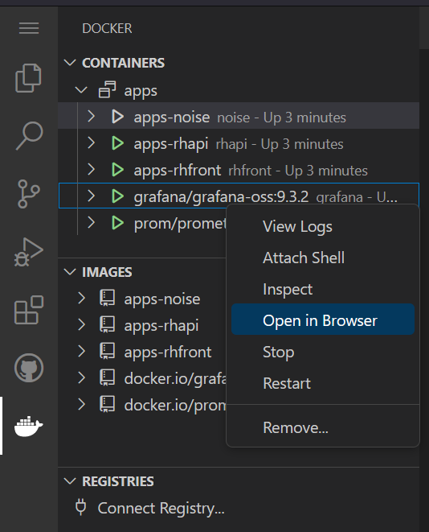
* Sur Grafana, se connecter :
    * Login: `admin`
    * MDP: `admin`
    * `Skip` à l'invitation de changer le mot de passe
* Créez un nouveau tableau de bord
    <br>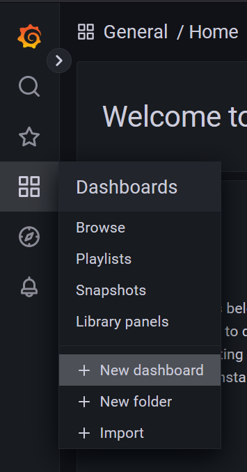
* Cliquez sur "Add a new panel"
* Vous vous retrouvez sur l'interface d'édition d'un composant de votre dashboard
    <br>

* Commencez par donner un titre à votre composant :
    <br>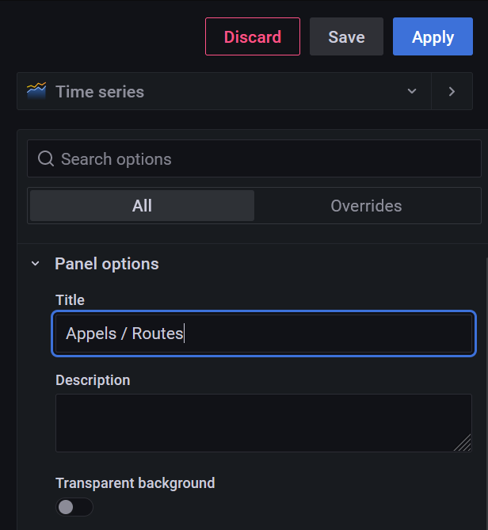

* Sélectionnez la métrique qui nous intéresse, à savoir `search_counter` :
    <br>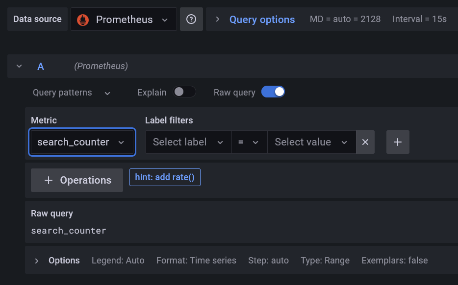

* Rafraichissez votre composant :
    <br>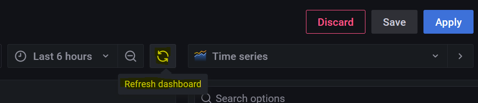

* A ce stade, on observe au moins quatre courbes : ce sont les appels faits sur l'api par le script noise.sh qui s'exécute dans un conteneur, allez voir sa définition ici : https://github.com/fmarques56/rhtest/blob/master/apps/monitoring/noise/noise.sh. Il fait simplement appel à quelques routes de notre API toutes les secondes pour générer du bruit et provoquer un incrément de notre métrique `search_counter`. Les courbes sont certainement compactées sur la droite, vous pouvez **réduire la plage temporelle que l'on souhaite visualiser à 15 minutes** :
    <br>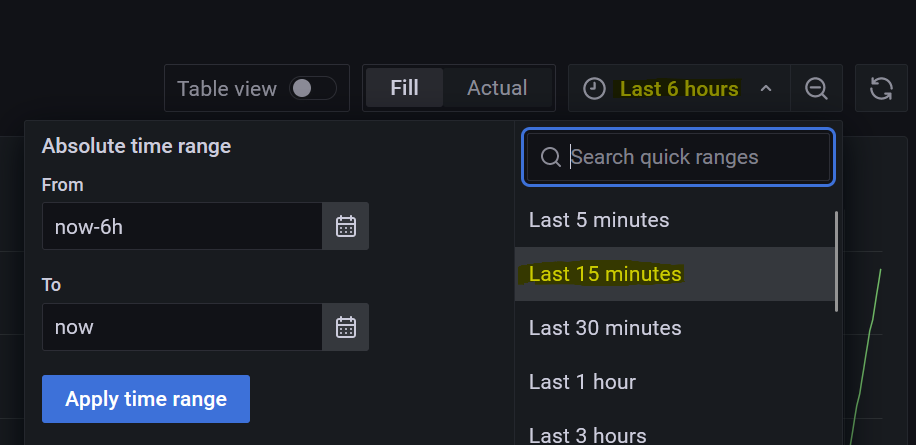

* Si vous regardez la légende en bas de votre graphique, vous retrouvez les labels associés à vos séries temporelles. Rappelez-vous, nous avions dit plus haut qu'une combinaison de labels = une série temporelle (= une courbe). On a donc un graphique qui affiche le nombre d'appels HTTP pour chaque combinaison de labels.
    <br>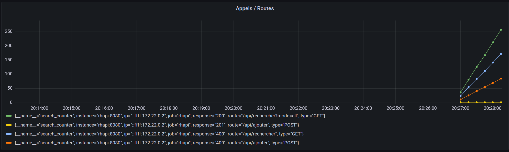

* Ce qui va nous intéresser, c'est d'avoir le nombre de requête par minutes, et non le total de requêtes depuis le lancement de l'application. Il existe une opération qui permet de calculer l'incrément d'une série sur une période donnée : la fonction `Increase`, que l'on va configurer sur 1 minute.
    <br>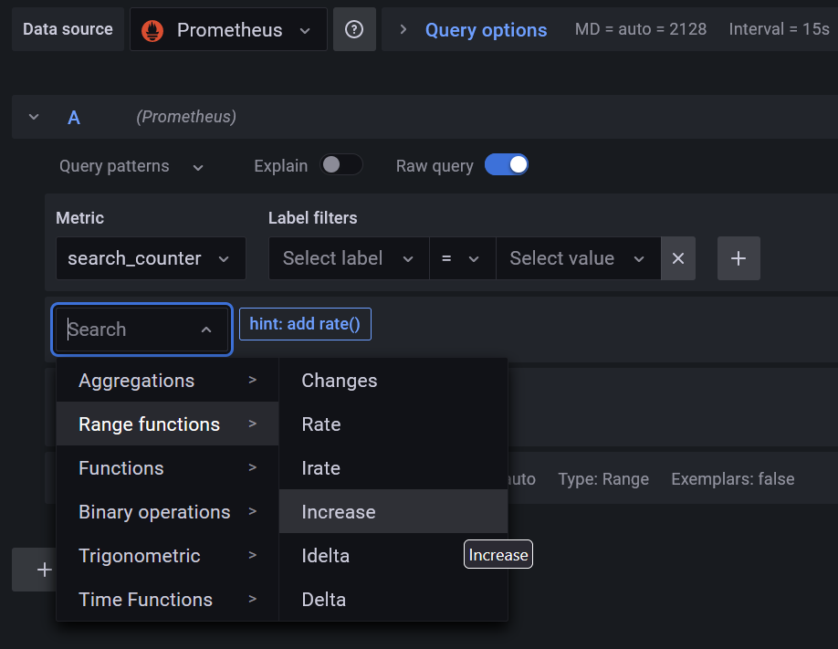
    <br>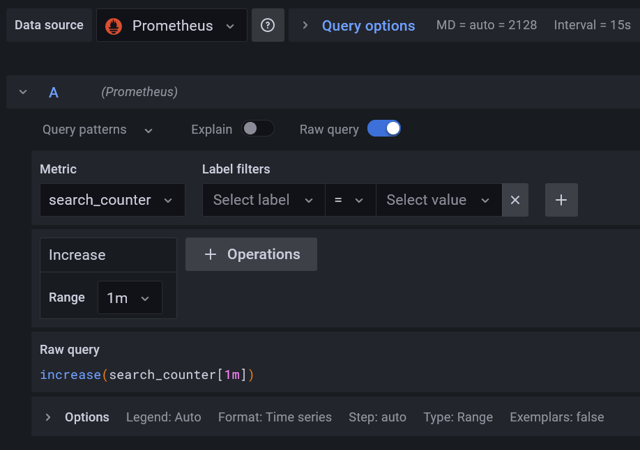

* Rafraichissez le graphique. Nos courbes nous donnent désormais le nombre d'appels HTTP par minute. On constate bien le résultat de notre script de génération de bruit qui lance des appels toutes les secondes, d'où des valeurs multiples de 60 pour un increase paramétré sur 1 minute.
    <br>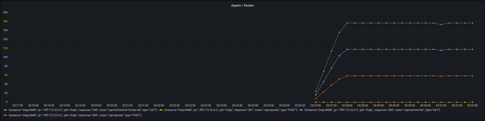

* Enfin, nous cherchions à afficher les appels HTTP par minute, pour chaque route. Actuellement, nous avons le nombre d'appels par minute, pour chaque combinaison de labels. Typiquement, on observe deux séries temporelles pour la route `/api/ajouter`. Nous allons donc regrouper les séries temporelles par route. Pour cela, ajouter l'opération `sum` dans la catégorie des fonctions d'agrégations : 
    <br>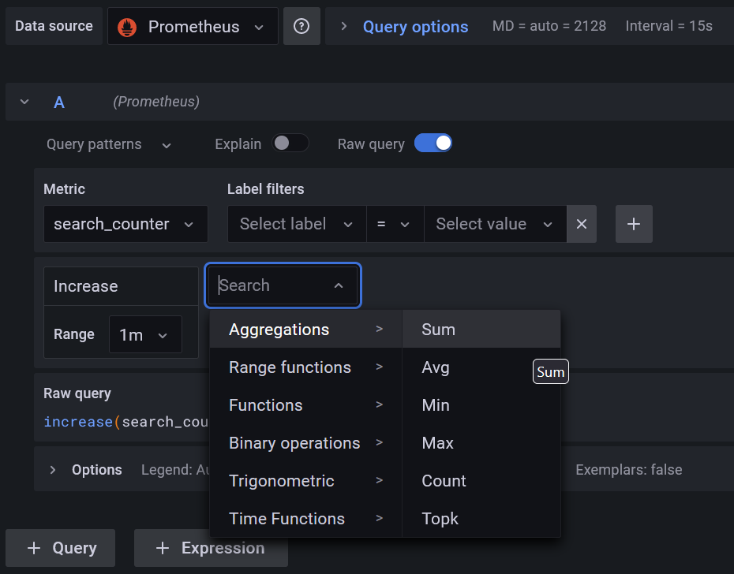
    <br>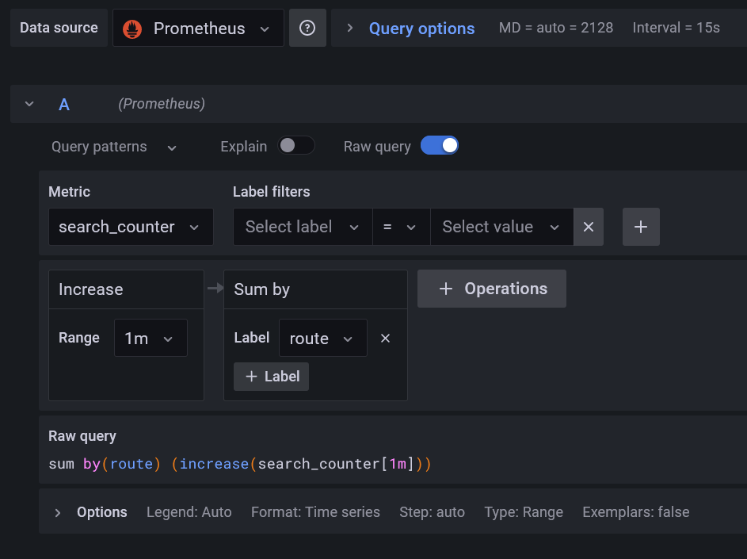

* Rafraissiez le graphique. Nous obtenons le résultat final que nous recherchions : la somme du nombre d'appels HTTP par minute pour chaque route de notre API.
    <br>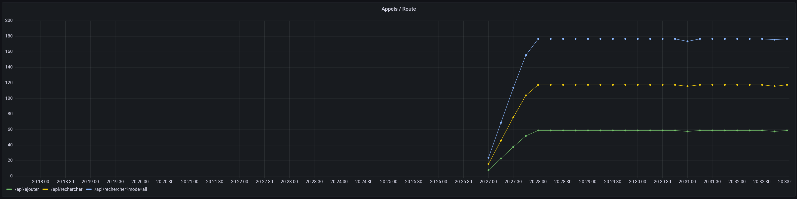

* Actuellement, on affiche un graphique de séries temporelles. Vous pouvez vous amuser à changer le type de graphique en haut à droite. Essayer par exemple le mode `Stat`, `Pie chart` ou même `Bar Gauge`. Vous pouvez revenir sur le graphique par défaut de type `Time series`.
    <br>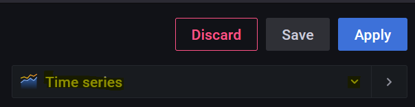


* Enregistrez votre composant avec le bouton `Apply` en haut à droite.
* Vous vous retrouvez sur votre tableau de bord, comportant votre nouveau composant. Enregistrez votre tableau de bord avec l'icône de disquette.
    <br>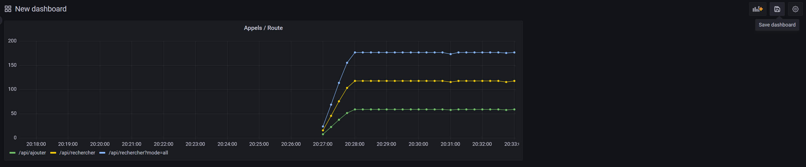


## A vous de jouer
Agrémentez votre tableau de bord en ajoutant de nouveaux composants pour :
1. Visualiser le nombre de requêtes HTTP par minute pour chaque code de réponse
2. Visualiser le nombre de requêtes HTTP par minute pour chaque adresse IP (en utilisant un autre type de visualisation, par exemple `Bar Gauge`)
3. Visualiser l'état actuel de notre API (UP ou DOWN)
    * Pour cela, vous pouvez utiliser la métrique `up` égale à 0 si l'appli est down, ou 1 si elle est up.
    * Essayez d'utiliser un graphique de type `Stat`, pour lequel vous pouvez définir le texte à afficher selon la valeur actuelle de la métrique dans les options `Value mappings` à droite.
    * On cherche à obtenir quelque-chose qui ressemble à ça :
        <br>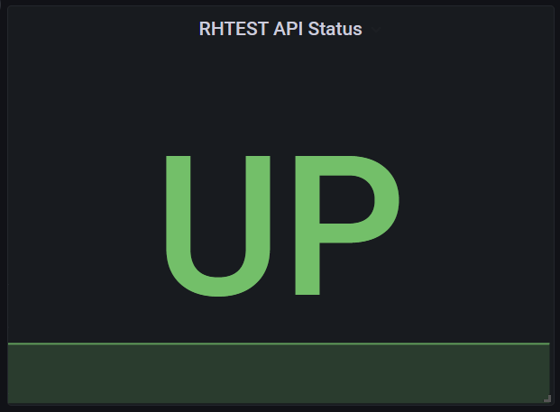
    * Vous pouvez stopper et redémarrer le conteneur de rhapi sur GitPod pour tester votre composant 😉
        <br>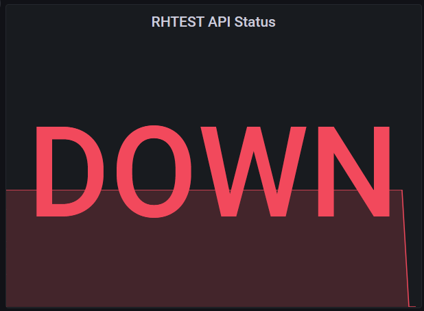
4. Visualiser le taux de disponibilité de notre API sur 1 heure (information très utilisée comme SLI !)
    * Là aussi, la métrique `up` est la plus adaptée.
    * Une opération permet de calculer la moyenne des valeurs sur une période donnée : `Range functions > Avg over time`
    * A l'aide du type de graphe `Gauge`, essayez d'obtenir le résultat suivant :
        <br>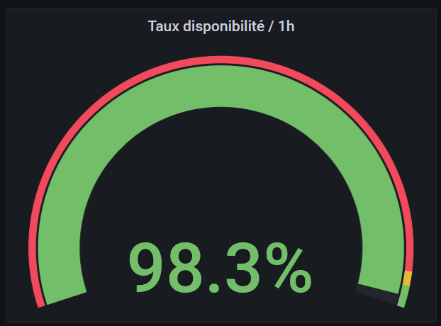
    * Si on coupe le conteneur de l'api, constatez le taux diminuer :
        <br>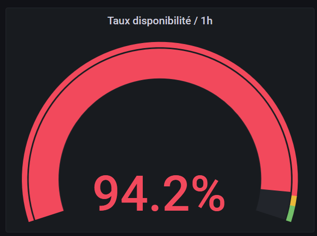
5. Visualiser le taux d'erreurs 4xx par minute (pas seulement 400 ou 409)
    * Tip 1 : vous pouvez filtrer vos labels en utilisant des regex avec le matching `=~`
    * Tip 2 : vous pouvez opérer des calculs entre deux séries temporelles avec l'opération `Binary operations > Binary operation with query`
    * Une fois votre composant créé, spammez la route `/api/rechercher` de rhapi dans votre naviguateur pour faire monter le taux d'erreurs 4xx

Une fois votre dashboard achevé, n'hésitez pas à couper le conteneur de noise et naviguer sur rhfront pour générer vos propres appels à l'API, et voir le comportement de votre dashboard.

Vous pouvez également réfléchir à d'autres composants qui vous semblent pertinents, ou simplement explorer les différents types de graphes pour améliorer ceux que vous venez de créer ! 😉


## Ce qu'il faut retenir
* Tester et vérifier le bon fonctionnement d'une application est une tâche qui s'opère tout au long du cycle de vie de cette dernière, **du début de sa conception jusqu'à la fin de son utilisation**.
* **Le coût d'une anomalie en production est bien plus grand qu'une anomalie détectée avant la mise en production**.
* De plus, **une anomalie en production a un impact direct sur l'image de votre produit**. Il est donc impératif de **les détecter le plus rapidement possible**.
* C'est dans ce but qu'on utilise des moyens de supervision, la collecte de métriques en faisant partie. **L'utilisation de métriques permet de détecter en temps réel un comportement anormal, et avoir une idication sur son origine**. Par exemple, un grand nombre d'erreurs 500 sur une route précise de notre API.
* Les métriques nous indiquent également si certaines spécifications de notre référentiel de test sont toujours respectées en production. **Ces spécifications constituent souvent nos SLI**, comme par exemple le taux de disponibilité de l'API.
* Enfin, dans un contexte de cybersécurité, avoir une stack de supervision peut **contribuer à détecter des comportements malveillants**. Par exemple, un soudain pic d'appels par un ensemble d'adresses IP peut suggérer une attaque par déni de service.
