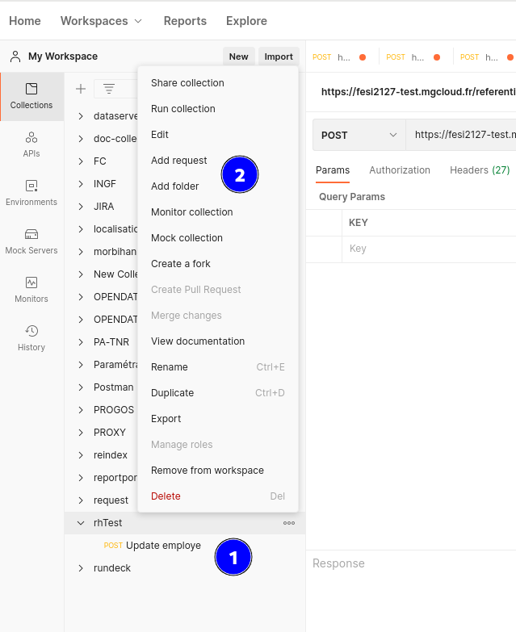

# TP: Tests des APi

L’objectif du TP est de découvrir le test des Api Rest.  

Une API permet d’exposer à des clients des méthodes et des objets de manière simple, mais le client
d’une API doit être assuré de la stabilité des signatures et du comportement pour une version
mineure donnée.

Il est donc intéressant de vérifier qu’une API reste stable et respecte son contrat d’interface dans le
temps. Pour cela il faut créer des tests fonctionnels et automatiser leur lancement pour qu’ils soient
exécutés lors de l’intégration continue.

Postman, en se basant sur les contrats, permet de créer rapidement de nouveaux cas
de tests, avant même que le travail de développement soit commencé (Contract First, Test Driven
Development).

Les assertions, points de contrôle, qui vérifient qu'un contrat est respecté s'attacheront à comparer
les codes de retours des appels, en commençant principalement par les cas nominaux (le cas
standard représentant 80% des appels effectués).

La variabilisation des données (Data Driven Testing) ainsi que le changement d'endpoint (cible)
permettent de rejouer facilement une suite de tests sur plusieurs environnements.

## Pré requis

 1. Démarrer l'application RhTest
 2. Disposer du référentiel d'exigences
 3. Utiliser la version en ligne de de Postman Open Source disponible [ici](https://www.postman.com/)
 

## Travail à réaliser

Vous êtes en charge des tests des API en ligne fournis avec l'application RhTest.

### Lancer Postman

#### Création du projet et des ressources à utiliser
Créer un nouveau projet vide

#### Création d’une suite de test et d’un cas de test
Créer une premiere requête

Compléter la requête

1- titre de la requête   
2- endPoint (exposition)   
3- les paramètres de requête.

Les APIs de l'application sont décrites sur le port 8080

Exemple complet

#### Les varialbles
Exemples de variables, ici la base URL

#### Les assertions

Exemple d'assertion :

Assert Content

Assert Status

#### La suite du TP

Réaliser tous les cas de tests correspondant à votre référentiel d'exigences.
