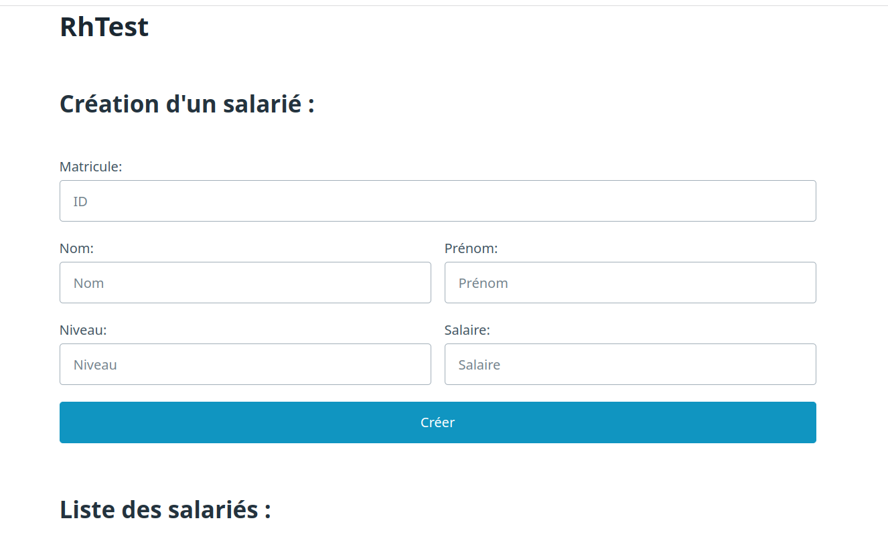
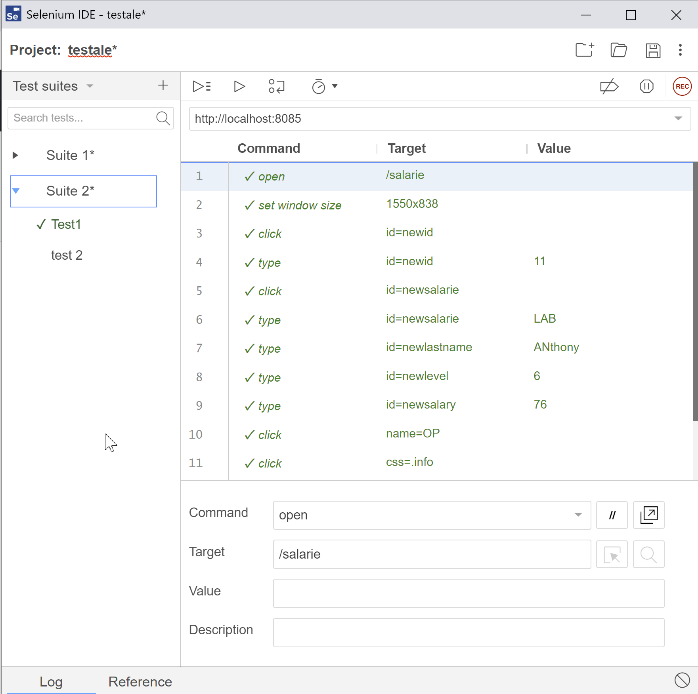
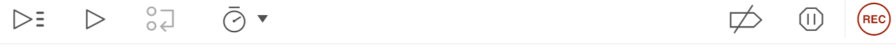
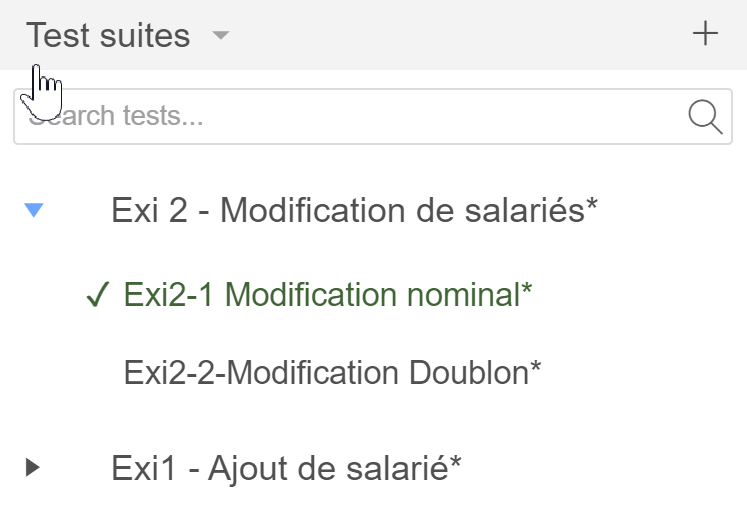
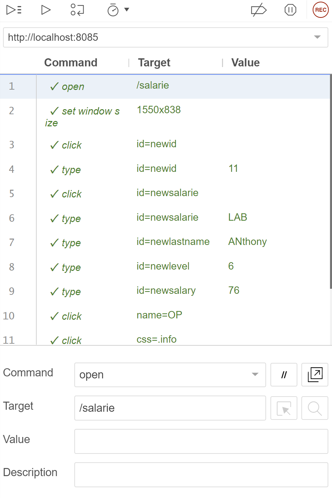
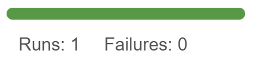
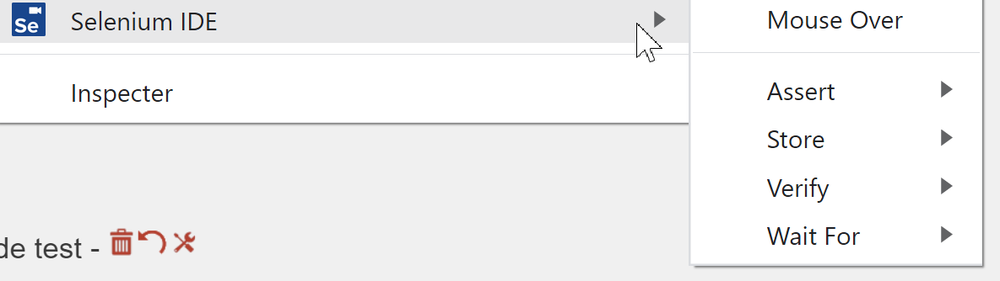

# TP - Construire son premier test fonctionnel automatisé

Dans ce TP, on cherche à vérifier que l'application graphique respecte les besoins du clients. On va donc enregistrer des scénarios utilisateur qui permettront de détecter les erreurs mais aussi de valider les fonctionnalités corrects (elles doivent le rester).

Pour corriger les bugs, les développeurs seront ensuite amené à retravailler sur l'application. Pour les testeurs, l'automate permettra de rapidement revalider l'application sans intervention humaine.

Aujourd'hui, nous utiliserons l'outil Selenium Ide qui permet de réaliser d'enregistrer des séquences d'actions (clic, saisie clavier), d'y ajouter des points de contrôles (présence d'un message d'erreur, ajout d'un utilisateur dans un tableau) et de les rejouer à volonté afin d'assurer la non regression de l'application sous test.

## Pré requis

1.  Démarrer l'application RhTest
2.  Disposer du référentiel d'exigences
3.  Installer le plugin Chrome ou Firefox Selenium IDE depuis la page https://www.selenium.dev/selenium-ide/

Une fois Selenium Ide installé, l'outil est disponible dans les barres d'outils de Chrome ou Firefox sur l'icone

## Présentation de Selenium Ide

Selenium Ide est un outil simple et facile d’utilisation qui permet de capturer un scénario utilisateur puis de le rejouer.
Il permet de comprendre rapidement l'intérêt des tests fonctionnels automatisés.

Une fois enregistrés, ces tests peuvent être sauvegardés au format .side par défaut. D'autres outils plus évolués permettent de prendre en charge des mangages Java, PHP, Javascript, etc. Les tests peuvent aussi être joués sur différents navigateurs Chrome, Firefox, ou sur les mobiles. Les tests pourront d'ailleurs être exécuté en mode ligne de commande et inséré sans une CI (https://www.seleniumhq.org/selenium-ideimg/en/introduction/command-line-runner/)

Selenium Ide respecte le standard Selenium. l existe différents projets qui utilisent la technologie Selenium :

- SideeX qui permet de comprendre les tests automatisés,
- [http://www.seleniumhq.org/projects/remote-control/](Selenium RC) qui permet de piloter différents navigateurs,
- [http://www.protractortest.org](Protractor) pour tester les applications AngularJS,
- et même des applications en ligne, comme [https://www.browserstack.com](BrowserStack), qui permettent aux développeurs web d'accéder à des fermes de navigateurs.

### Interface Graphique de Selenium Ide

Une fois démarré, l'interface Selenium IDE se décompose en plusieurs sections

#### Barre d'outils

La barre d'outils contient des boutons qui permettent de contrôler l'exécution des cas de tests et notamment la rapidité d'exécution (il es parfois nécessaire de jouer sur la rapidité d'exécution).

#### Volets Cas de Test

Dans ce volet, on organisera les cas de tests en fonction du référentiel d'exigences

#### Volets Détail du Cas de Test

Ce volet permet de détailler chacune des actions de test et des points de contrôle. En éxécution il permet également de suivre chacune des étapes de test et leur résultat.

#### Volets Résultats et log

Ce volet permet de consolider le nombre de test passant ou en échec. Le détail de l'éxécution se trouve quanà un lui dans un journal d'exécution en bas de la fenêtre SideeX.

## Pour aller plus loin

En plus des commandes disponibles via l'enregistrement, Selenium peut utiliser les méthodes suivantes :

- `open` : ouvre une page à l'aide d'une URL.
- `click` : effectue une opération de clic
- 'wait for element present', attent la présence de l'élément sur la page.
- `verify` : Effectue une vérification (non bloquante) sur la page.
- `Assert` : Effectue une vérification et arrete le scénario en cas d'échec.

D'autres commandes sont également disponibles sur le site: https://www.selenium.dev/selenium-ideimg/en/api/commands.

A noter que dans le navigateur vous trouverez également les commandes contextuelles disponibles:

Ceci permet de faciliter la mise en place de point de contrôle. Attention toutefois à cette méthode qui semble rapide et pourtant peut engendrer des problème de qualité. En effet l'enregistrement des proints de controles présume que le logiciel mis sous test et en bon état de fonctionnement, ce qui n'est pas le cas dans notre cas de figure...

## Travail à réaliser

_ex 01 :_ Créer  
Dans la suite de test "Créer", il va falloir

- _Cas de test 1 :_ Cas nominal (fonctionnel)  
  Ajouter un employé  
  Et contrôler avec au moins 1 assertion
- _Cas de test 2 :_ Cas en erreur  
  Ajouter un employé avec des critères invalides  
  Et contrôler avec au moins 1 assertion
- _Cas de test 3 :_ Cas en erreur  
  Ajouter un employé avec des critères obligatoires non renseignés
  Et contrôler avec au moins 1 assertion
- _Cas de test 4 :_ Cas en erreur (duplication)  
  Ajouter 2x le même employé  
  Et contrôler avec au moins 1 assertion

_ex 02 :_ Modifier  
Dans la suite de test "Modifier", il va falloir

- _Cas de test 1 :_ Cas nominal (fonctionnel)  
  Ajouter un employé puis modifier un critère (le salaire)  
  Et contrôler avec au moins 1 assertion
- _Cas de test 2 :_ Cas en erreur  
  Ajouter un employé avec des critères valides puis modifier un critère avec une donnée en erreur (salaire néfgatif)  
  Et contrôler avec au moins 1 assertion

_ex 03 :_ Rechercher  
Dans la suite de test "Rechercher", il va falloir

- _Cas de test 1 :_ Cas nominal (fonctionnel)  
  Ajouter un employé puis le rechercher  
  Et contrôler avec au moins 1 assertion
- _Cas de test 2 :_ Cas en erreur (vide)  
  Ajouter un employé avec des critères valides puis rechercher sur d'autres critères
  Et contrôler avec au moins 1 assertion

_ex 04 :_ Supprimer  
Dans la suite de test "Supprimer", il va falloir

- _Cas de test 1 :_ Cas nominal (fonctionnel)  
  Ajouter un employé puis le supprimer  
  Et contrôler avec au moins 1 assertion
- _Cas de test 2 :_ Cas en erreur (vide)  
  Supprimer un employé inexistant
  Et contrôler avec au moins 1 assertion

Une fois que l'ensemble des exigences sont enregistrées, rejouer la séquence complète.
