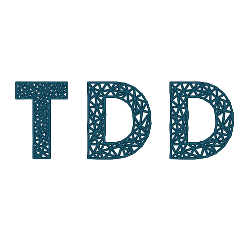
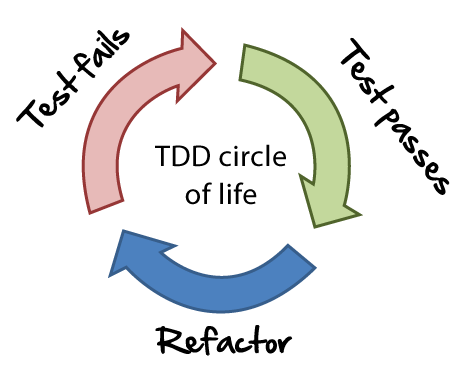

# Tests unitaires

La technique TDD, les librairies de tests unitaires, la couverture de code.

Mise en pratique



---

# La technique TDD (Test Driven Development)

Le développement piloté par les tests est une technique qui demande l’écriture des tests unitaires avant l’écriture du code.

C’est une technique itérative et incrémentale, le cycle est répété tout au long du développement de l’application et pour chaque incrément technique ou fonctionnel.

---

# Cycle du TDD

- Écrire le test
- Vérifier que le test échoue
- Écrire le code
- Vérifier que le test passe
- Refactoriser le code



---

# Librairies de tests

 
 

---

# La couverture de code

Quatre principales méthodes de couverture de code par les tests :

• Couverture des fonctions : combien de fois une fonction est appelée
• Couverture des instructions : combien de fois une ligne de code est appelée
• Couverture des points de tests : combien de valeurs de variables sont testées
• Couverture des chemins d’exécution : combien de parcours possibles sont testés

---

#


---

# Couverture de code à MGDIS

Profils `Quality gates` Sonar :

- A+ 90% de couverture
- A > 80% de couverture
- B > 70% de couverture
- C > 60% de couverture

Si couverture inférieure au profil défini => build Gitlab KO 🚨

---

# Démonstration

Démonstration rapide d'un développement en TDD.

```js
function hello() {
  return 'Hello world !
}
```

---

# Mise en pratique

https://bit.ly/4bi1SwJ


Cliquer sur le bouton 


---

# Pour aller plus loin

- Tests snapshot
- Écriture des tests assisté par IA

---

# Pour aller plus loin (suite)

Architecture hexagonale ([conférence Devoxx](https://youtu.be/-dXN8wkN0yk?si=zbGllnyK7g1wG_Sg))

Quelques katas pour s'entraîner au TDD :

- http://codingdojo.org/kata/FizzBuzz/
- http://codingdojo.org/kata/StringCalculator/
- http://codingdojo.org/kata/Bowling/
