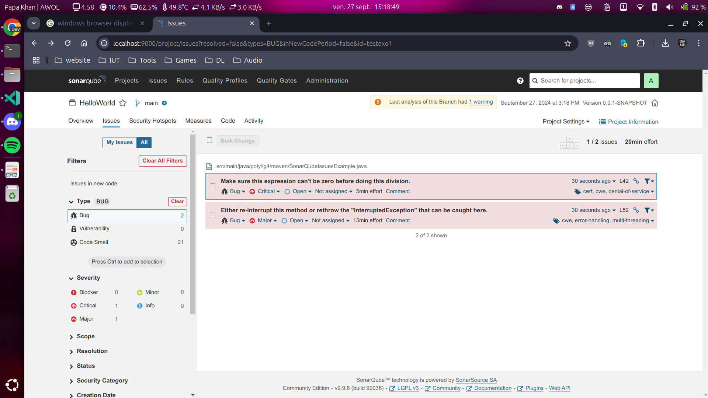
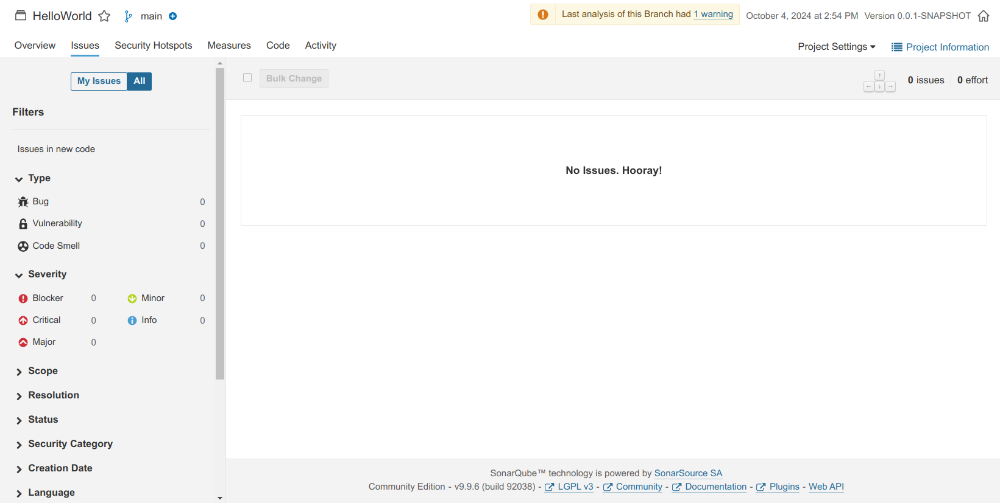
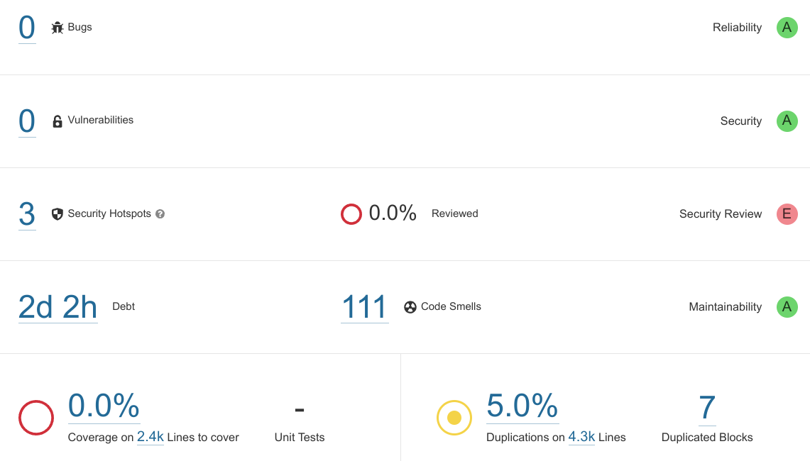
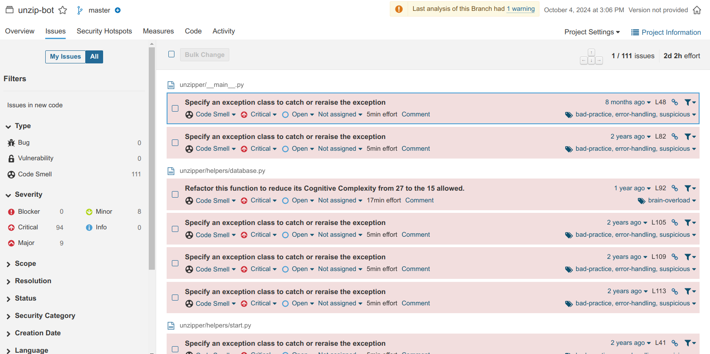
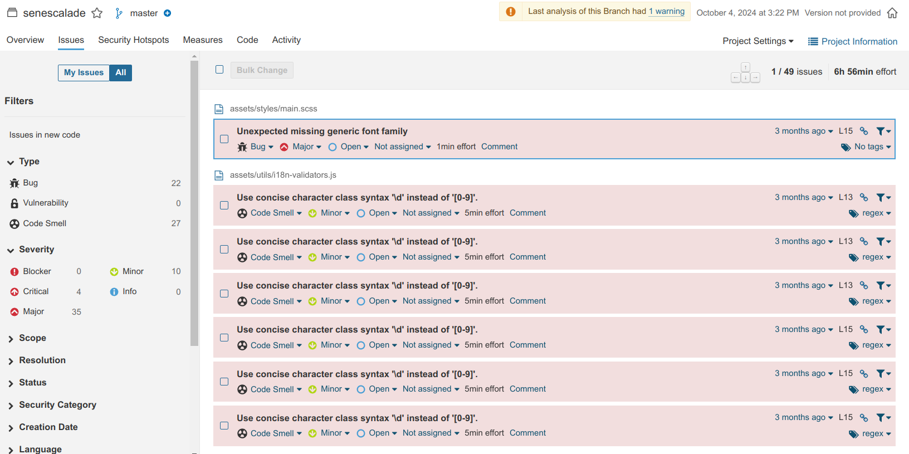
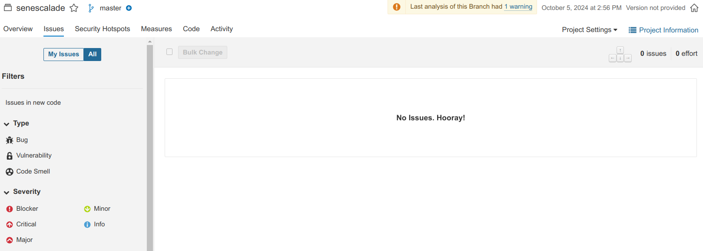

## R5.A.04 - TP2


## Run
```bash
docker volume create --name sonarqube_data
docker volume create --name sonarqube_logs
docker volume create --name sonarqube_extensions
```

```bash
docker compose up
```

Le site est à http://localhost:9000 (admin admin)  
Sur l'interface Web de SonarQube, cliquez sur le bouton « Manually » pour créer un nouveau projet.  
Donnez-lui un nom unique, par exemple : `tp-r5a04-sq1`  
Après avoir créé le projet, sélectionnez l'option « Analyze your project locally » en cliquant sur « Locally ».  
Un jeton d'accès sera généré. Prenez note de ce jeton, car il sera utilisé pour déclencher l'analyse depuis Maven.

```bash
cd ex1 && mvn clean verify sonar:sonar \
-Dsonar.projectKey=tp-sonarqube \
-Dsonar.host.url=http://localhost:9000 \
-Dsonar.login=JETON
```

## Images
- Helloworld init :

- Helloworld fixed :

- Projet perso 1 :

- Projet perso 1 issues :

- Projet perso 2 issues :

- Projet perso 2 fixed :

